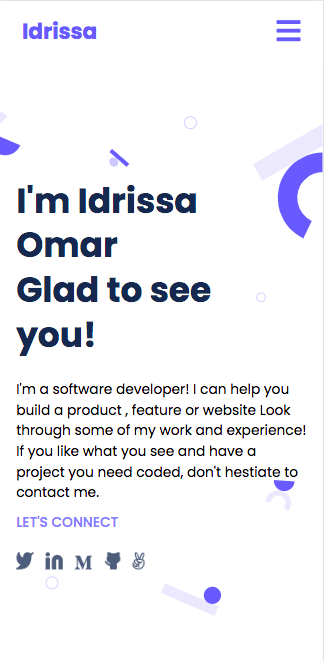
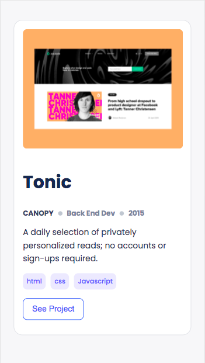

## Portfolio-mobile-version-skeleton

> Build my skeleton version mobile portfolio using HTML/CSS only.

## Screenshots

> Build my skeleton version mobile portfolio using HTML/CSS only.

# Using flexbox, grid, ...

## Built With

- HTML/CSS
- Linters

## Live Demo (if available)

[Live Demo Link](https://portfolio-omarbabou.github.io/)

## Getting Started

To get a local copy up and running follow these simple example steps.

### Prerequisites

1. You should have basic knowledge of HTML, CSS, Grid, Flexbox, Github, Git, Linters and Figma.
2. You must install live server in your source-code editor.
3. Create the index.html file and then open it in the browser via live server.

### Setup

1. Linters

### Install

1. Git
1. Node

### Usage

clone this repository:

git clone https://github.com/omarbabou/portfolio-mobile-version-skeleton.git

## Author 1

👤 Idrissa Omar

- GitHub: [@omarbabou](https://github.com/omarbabou)
- Twitter: [@BabouOmar3](https://twitter.com/BabouOmar3/photo)
- LinkedIn: [idrissa-makoba](https://www.linkedin.com/in/idrissa-makoba-b5b906205/)

👤 **Author 2**

👤 Soulemanou Babanou

- GitHub: [@soulemanou-software](https://github.com/soulemanou-software)
- Twitter: [@Fastevz1](https://twitter.com/Fastevz1)
- LinkedIn: [soulemanou kunchiefuh babanou](https://www.linkedin.com/in/soulemanou-kunchiefuh-babanou-454099196)

## 🤝 Contributing

Contributions, issues, and feature requests are welcome!

Feel free to check the [issues page](../../issues/).

## Show your support

Give a ⭐️ if you like this project!

## Acknowledgments

- Hat tip to anyone whose code was used
- Inspiration
- etc

## 📝 License

This project is [MIT](./MIT.md) licensed.

# Personal-Portfolio

Build my skeleton version mobile portfolio using HTML/CSS.

# portfolio-mobile-version-skeleton

Build my skeleton version mobile portfolio using HTML/CSS only.
