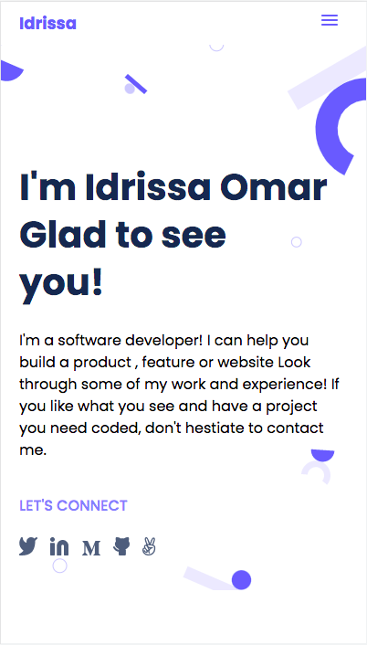

## Portfolio-mobile-version-skeleton

> Build my skeleton version mobile portfolio using HTML/CSS only.
## Screenshoots

## Built With

- HTML/CSS 
- Linters 

## Live Demo (if available)

[Live Demo Link](https://livedemo.com)

## Getting Started

To get a local copy up and running follow these simple example steps.

### Prerequisites

1. You should have basic knowledge of HTML, CSS, Grid, Flexbox, Github, Git, Linters and Figma.
2. You must install live server in your source-code editor.
3. Create the index.html file and then open it in the browser via live server.

### Setup

1. Linters 

### Install

1. Git
1. Node 

### Usage

clone Repository this repository: 

git clone https://github.com/omarbabou/portfolio-mobile-version-skeleton.git

## Authors

👤 Idrissa Omar

- GitHub: [@omarbabou](https://github.com/omarbabou)
- Twitter: [@BabouOmar3](https://twitter.com/BabouOmar3/photo)
- LinkedIn: [idrissa-makoba](https://www.linkedin.com/in/idrissa-makoba-b5b906205/)

## 🤝 Contributing

Contributions, issues, and feature requests are welcome!

Feel free to check the [issues page](../../issues/).

## Show your support

Give a ⭐️ if you like this project!

## Acknowledgments

- Hat tip to anyone whose code was used
- Inspiration
- etc

## 📝 License

This project is [MIT](./MIT.md) licensed.
